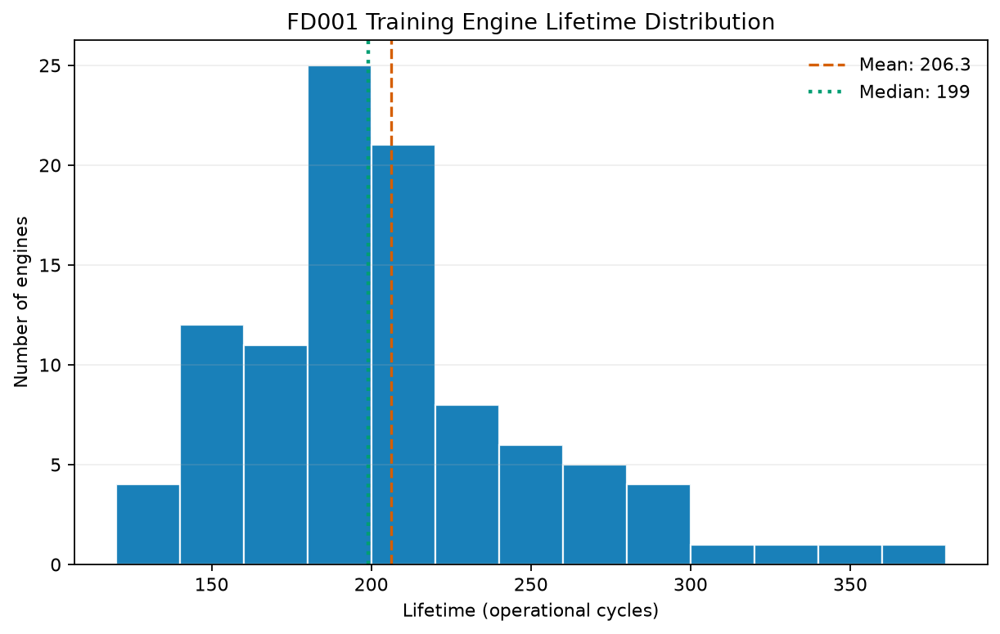
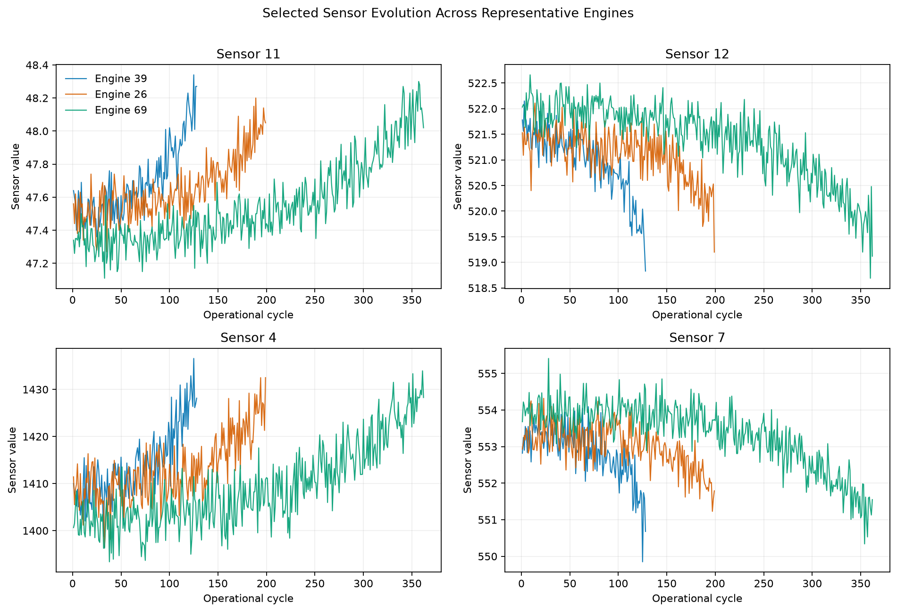
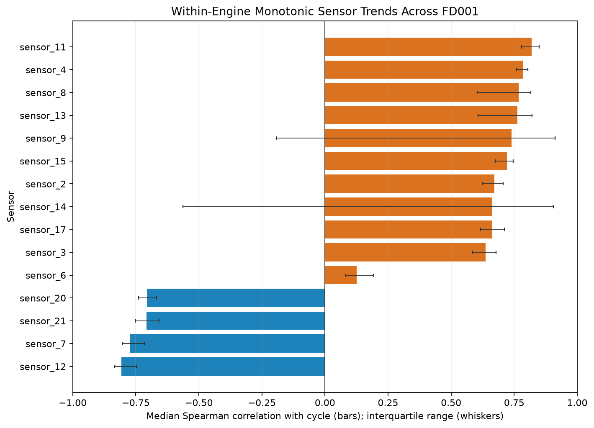

# NASA C-MAPSS Turbofan Remaining Useful Life Prediction

An educational project for estimating how many operating cycles a turbofan engine
has left before failure using its measurement history. The intended task is
supervised regression, with Remaining Useful Life (RUL) measured in operational
cycles.

## Status

**Milestone 1: FD001 dataset exploration.** The repository now provides verified
dataset acquisition, reusable data loading and validation, an executed EDA
notebook, and seven focused static figures. It does not yet contain training RUL
targets, model-oriented preprocessing, sequence windows, or ML models.

## Dataset

NASA C-MAPSS contains simulated degradation histories for a fleet of turbofan
engines. This project currently examines only FD001: 100 training engines, 100
test engines, one operating condition, and one high-pressure compressor
degradation mode.

The FD001 files have distinct roles:

| File | Meaning |
| --- | --- |
| `train_FD001.txt` | Complete run-to-failure trajectories for the training engines. |
| `test_FD001.txt` | Partial trajectories for a separate set of test engines; each trajectory stops before failure. |
| `RUL_FD001.txt` | One true remaining-cycle value for the final observed row of each test engine, in test-engine order. It is an evaluation reference, not a training input. |

A trajectory is one engine's observations ordered by cycle. One train/test row
represents one engine at one operational cycle and contains an engine ID, cycle
index, three operational settings, and 21 sensor readings. Trajectories can have
different lengths. Matching IDs in training and test files do not identify the
same physical engine.

### Reproducible acquisition

The download script uses the official NASA Prognostics Center of Excellence URL,
verifies the SHA-256 checksums of both nested ZIP archives, and extracts the data
under `data/raw/CMAPSSData/`:

```bash
python scripts/download_cmapss.py
```

The official archive contains FD001 through FD004; this milestone loads and
analyzes only the three FD001 files listed above. Everything below `data/raw/`
is ignored by Git except its empty placeholder, so raw data is never committed.
If the files are already present, the script exits without downloading them again.

## Intended system inputs and output

| Component | Meaning |
| --- | --- |
| Inputs | One engine's operational settings and sensor observations available up to the prediction cycle, in chronological order. |
| Identifiers | `unit_id` groups observations; `cycle` orders them and locates the prediction time. Unit ID is not a physical sensor. |
| Output | One nonnegative estimate of remaining operational cycles at that time. |

Future measurements and test RUL labels must not become inputs. Feature selection,
history length, target engineering, and model choice remain open for later
milestones.

## Exploratory Data Analysis

The executed notebook is
[`notebooks/01_fd001_eda.ipynb`](notebooks/01_fd001_eda.ipynb). It imports reusable
loading and validation logic from `src/turbofan_rul/` and generates figures with
Matplotlib.

Verified FD001 statistics:

| Statistic | Training | Test observations |
| --- | ---: | ---: |
| Shape | 20,631 × 26 | 13,096 × 26 |
| Engines | 100 | 100 |
| Minimum cycles per trajectory | 128 | 31 |
| Median cycles per trajectory | 199 | 133.5 |
| Mean cycles per trajectory | 206.31 | 130.96 |
| Maximum cycles per trajectory | 362 | 303 |

The test cycle counts are observed trajectory lengths, not complete lifetimes. The
separate 100 test endpoint RUL values range from 7 to 145 cycles.

The validation checks found no missing cells, duplicated rows, duplicated
`unit_id`/`cycle` pairs, non-finite values, invalid identifiers, or gaps in the
per-engine cycle sequences. Seven columns are exactly constant in training:
`operational_setting_3`, `sensor_1`, `sensor_5`, `sensor_10`, `sensor_16`,
`sensor_18`, and `sensor_19`. Under the notebook's explicit near-constant rule
(one exact value in at least 95% of rows), `sensor_6` is near-constant because its
dominant value occurs in about 98.03% of rows. No columns are removed.

Within individual engines, sensors 11 and 4 generally rise with cycle while
sensors 12 and 7 generally fall. Sensors 8 and 13 also usually rise. These are
descriptive monotonic trends, not evidence that a sensor will improve RUL
predictions on unseen engines. Sensor 9 and sensor 14 have the strongest pairwise
linear relationship in the training rows (Pearson correlation about 0.963), but
their within-engine trends vary substantially across engines.







Additional figures under `reports/figures/` show operational settings, selected
sensor distributions, raw sensor variance, and the non-constant sensor correlation
matrix. Raw variance values are shown only as descriptive measurements; their
magnitudes are not feature importance because sensors use different units and
scales.

## Repository structure

```text
rul_predict/
├── .gitignore
├── Codex Master Project Brief.md
├── README.md
├── pyproject.toml
├── data/
│   ├── raw/
│   │   └── .gitkeep
│   └── processed/
│       └── .gitkeep
├── models/
│   └── .gitkeep
├── notebooks/
│   └── 01_fd001_eda.ipynb
├── reports/
│   └── figures/
│       ├── fd001_engine_lifetimes.png
│       ├── fd001_operational_settings.png
│       ├── fd001_sensor_correlation.png
│       ├── fd001_sensor_distributions.png
│       ├── fd001_sensor_evolution.png
│       ├── fd001_sensor_trends.png
│       └── fd001_sensor_variance.png
├── scripts/
│   └── download_cmapss.py
└── src/
    └── turbofan_rul/
        ├── __init__.py
        ├── data.py
        └── eda.py
```

## Reproduce the EDA

Use Python 3.11 or newer and run from the project directory:

```bash
python3 -m venv .venv
source .venv/bin/activate
python -m pip install --upgrade pip
python -m pip install -e ".[notebook]"
python scripts/download_cmapss.py
jupyter nbconvert --to notebook --execute --inplace notebooks/01_fd001_eda.ipynb
```

To inspect and rerun cells interactively:

```bash
jupyter lab notebooks/01_fd001_eda.ipynb
```

## Official source and attribution

The data is provided by NASA Ames Research Center's Prognostics Center of
Excellence (PCoE), using the Commercial Modular Aero-Propulsion System Simulation
(C-MAPSS). The official
[NASA Prognostics Data Repository](https://www.nasa.gov/intelligent-systems-division/discovery-and-systems-health/pcoe/pcoe-data-set-repository/)
lists it under **6. Turbofan Engine Degradation Simulation**.

Dataset citation, as listed by NASA:

> A. Saxena and K. Goebel (2008). “Turbofan Engine Degradation Simulation Data Set”,
> NASA Prognostics Data Repository, NASA Ames Research Center, Moffett Field, CA.

The [NASA Open Data record](https://data.nasa.gov/dataset/cmapss-jet-engine-simulated-data)
describes the training/test protocol, columns, and four subsets.
